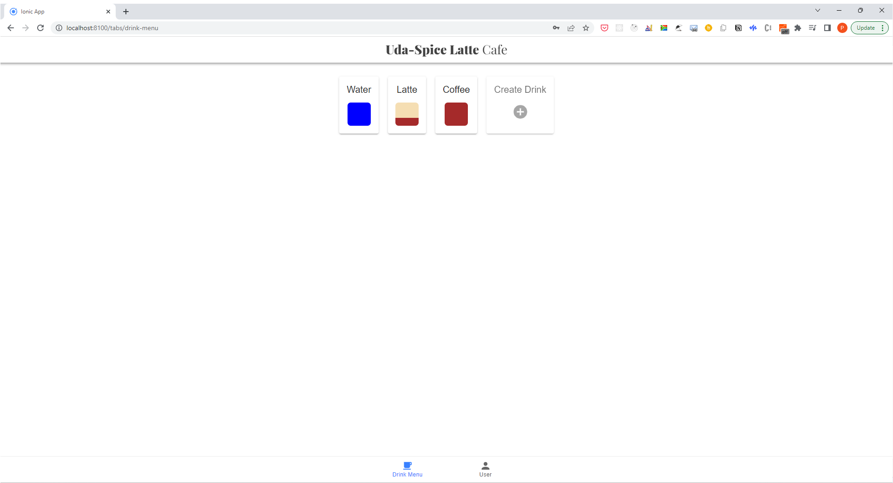

# Coffee Shop App

> The Coffee Shop App demonstrates role-based access for managers and baristas to administer and serve coffee drinks from a mobile web page. This project demonstrates a fullstack app powered by a Flask API and a Ionic frontend.


## Coffee Shop App demo




## Overview

The application showcases the following features:

* Display graphics representing the ratios of ingredients in each drink.
* Allow public users to view drink names and graphics.
* Allow the shop baristas to see the recipe information.
* Allow the shop managers to create new drinks and edit existing drinks.
* Object-oriented thinking in Python, including abstract classes, class methods, and static methods.
* DRY (don't repeat yourself) principles of class and method design.
* Working with modules and packages in Python.
* Coding best practices for style and documentation
* Ensuring that code, docstrings, and comments adhere to [PEP 8 Standards](https://www.python.org/dev/peps/pep-0008/).

## Installation

### Requirements
The project requires `pip` installed.

If you do not have `pip` installed, you can download it here: [pip](https://pip.pypa.io/en/stable/installing/)

### Setup

1. **Clone the source locally:
```sh
$ git clone https://github.com/thepembeweb/coffee-shop-app.git
```

2. **Navigate to the backend folder:
```sh
$ cd coffee-shop-app/backend
```

3. **Initialize and activate a virtualenv using:**
```
python -m virtualenv env
source env/bin/activate
```
>**Note** - In Windows, the `env` does not have a `bin` directory. Therefore, you'd use the analogous command shown below:
```
source env/Scripts/activate
```

4. **Install project dependencies:
```sh
$ pip install -r requirements.txt
```

5. **Run the development server:**
```
export FLASK_APP=api.py
export FLASK_ENV=development # enables debug mode
flask run
```

6. **Verify on the Browser**<br>
Navigate to project homepage [http://127.0.0.1:5000/](http://127.0.0.1:5000/) or [http://localhost:5000](http://localhost:5000)

7. **Navigate to the frontend folder:
```sh
$ cd coffee-shop-app/frontend
```

10. **Install project dependencies:
```sh
$ npm install
```

11. **Start the app in development mode:
```sh
$ ionic serve
```

12. **Open the browser at localhost:8100


## Built With

* [Python 3](https://www.python.org/) - The programming language used
* [Flask](https://palletsprojects.com/p/flask/) - The web framework used


## Authors

* **[Pemberai Sweto](https://github.com/thepembeweb)** - *Initial work* - [Trivia App](https://github.com/thepembeweb/coffee-shop-app)

## License

[](http://badges.mit-license.org)

- This project is licensed under the MIT License - see the [LICENSE.md](LICENSE.md) file for details
- Copyright 2022 © [Pemberai Sweto](https://github.com/thepembeweb).
